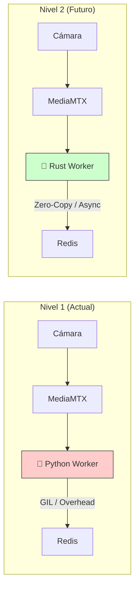

# 🎬 Arquitectura Híbrida de Alto Rendimiento con MediaMTX

## Índice
1. [Resumen Ejecutivo](#resumen-ejecutivo)
2. [Arquitectura Actual vs Propuesta](#arquitectura-actual-vs-propuesta)
3. [Componentes del Sistema](#componentes-del-sistema)
4. [Plan de Implementación](#plan-de-implementación)
5. [Grabación de Video](#grabación-de-video)
6. [Compatibilidad Móvil](#compatibilidad-móvil)
7. [Configuración de Puertos](#configuración-de-puertos)
8. [FAQ y Troubleshooting](#faq-y-troubleshooting)

---

## Resumen Ejecutivo

### El Problema Actual
El sistema actual tiene **cuellos de botella** porque Python hace demasiadas tareas:
- ✅ Captura video
- ✅ Detección IA
- ⚠️ **Dibuja cajas** (CPU intensivo)
- ⚠️ **Codifica JPEG** (CPU intensivo)
- ⚠️ **Sirve MJPEG** (no escala)

### La Solución Propuesta
Separar responsabilidades usando **MediaMTX** (servidor Go ultra-eficiente):

| Componente | Responsabilidad |
|------------|-----------------|
| **Python** | Solo detecta y envía coordenadas JSON |
| **MediaMTX** | Distribuye video (WebRTC/HLS) |
| **Vue + Canvas** | Dibuja cajas usando GPU del cliente |
| **Redis** | Canal de datos en tiempo real |

### Beneficios Esperados

| Métrica | Antes | Después | Mejora |
|---------|-------|---------|--------|
| CPU Worker | 80-100% | 30-40% | **~60% menos** |
| Latencia video | 500ms-2s | <100ms | **10x mejor** |
| Usuarios simultáneos | ~5-10 | ~100+ | **10x+ escalable** |
| Ancho de banda | 2-5 Mbps | 0.5-1 Mbps | **5x menos** |
| Compatibilidad móvil | ❌ Limitada | ✅ Nativa | **100%** |

---

## Arquitectura Actual vs Propuesta

### 🔴 Arquitectura Actual (Monolítica)

```
┌─────────────────────────────────────────────────────────────────┐
│                    FLUJO ACTUAL (INEFICIENTE)                   │
├─────────────────────────────────────────────────────────────────┤
│                                                                 │
│   YouTube/RTSP                                                  │
│       │                                                         │
│       ▼                                                         │
│   ┌─────────────────────────────────────────────────────────┐  │
│   │              AI WORKER (Python) - SOBRECARGADO           │  │
│   │                                                          │  │
│   │   [Captura] → [Detección] → [DIBUJO] → [ENCODE] → [HTTP] │  │
│   │                               ⚠️ CPU    ⚠️ CPU    ⚠️ CPU  │  │
│   └──────────────────────────────────────────────────────────┘  │
│       │                                                         │
│       │ MJPEG (frames con cajas ya dibujadas)                   │
│       │ ~2-5 Mbps por usuario                                   │
│       ▼                                                         │
│   ┌─────────────┐                                               │
│   │   Frontend  │  Solo muestra  estática                  │
│   │   (Vue)     │  No puede modificar el video                  │
│   └─────────────┘                                               │
│                                                                 │
└─────────────────────────────────────────────────────────────────┘

Problemas:
• 1 usuario = 1 stream procesado
• 10 usuarios = 10x CPU para encoding
• Latencia 500ms-2s
• No funciona bien en móviles
• No se puede grabar fácilmente
```

### 🟢 Arquitectura Propuesta (Híbrida MediaMTX)

```
┌──────────────────────────────────────────────────────────────────────────────┐
│                      FLUJO PROPUESTO (EFICIENTE)                             │
├──────────────────────────────────────────────────────────────────────────────┤
│                                                                              │
│   YouTube/RTSP                                                               │
│       │                                                                      │
│       ▼                                                                      │
│   ┌─────────────────────────────────────────────────────────────────────┐   │
│   │                   AI WORKER (Python) - LIGERO                        │   │
│   │                                                                      │   │
│   │   [Captura] ──┬──► [FFmpeg] ──► RTSP a MediaMTX (video limpio)      │   │
│   │               │                                                      │   │
│   │               └──► [Detección IA] ──► JSON coords ──► Redis         │   │
│   │                                                                      │   │
│   │   ❌ NO dibuja    ❌ NO encode JPEG    ❌ NO sirve HTTP              │   │
│   └─────────────────────────────────────────────────────────────────────┘   │
│                          │                              │                    │
│                          │ RTSP                         │ JSON               │
│                          ▼                              ▼                    │
│   ┌─────────────────────────────┐           ┌───────────────────┐           │
│   │        MediaMTX (Go)        │           │      Redis        │           │
│   │                             │           │    (Pub/Sub)      │           │
│   │  • Recibe RTSP              │           └─────────┬─────────┘           │
│   │  • Convierte a:             │                     │                     │
│   │    - WebRTC (UDP, <100ms)   │                     │ WebSocket           │
│   │    - HLS (HTTP, móviles)    │                     │                     │
│   │    - RTSP (grabación)       │                     ▼                     │
│   │                             │           ┌───────────────────┐           │
│   │  • Graba a archivo MP4/MKV  │           │  Laravel/Reverb   │           │
│   └──────────────┬──────────────┘           │   (WebSocket)     │           │
│                  │                          └─────────┬─────────┘           │
│                  │ WebRTC/HLS                         │                     │
│                  │ (video sin cajas)                  │ coords JSON         │
│                  ▼                                    ▼                     │
│   ┌─────────────────────────────────────────────────────────────────────┐   │
│   │                        FRONTEND (Vue.js)                             │   │
│   │                                                                      │   │
│   │   ┌──────────────────┐    ┌─────────────────────────────────────┐   │   │
│   │   │  <video> WebRTC  │    │         <canvas> Overlay             │   │   │
│   │   │   o <video> HLS  │    │                                      │   │   │
│   │   │                  │    │   • Recibe JSON por WebSocket        │   │   │
│   │   │  Video limpio    │    │   • Dibuja cajas con Canvas API      │   │   │
│   │   │  desde MediaMTX  │    │   • Usa GPU del dispositivo          │   │   │
│   │   │                  │    │   • 60 FPS de renderizado            │   │   │
│   │   └──────────────────┘    └─────────────────────────────────────┘   │   │
│   │                                                                      │   │
│   └─────────────────────────────────────────────────────────────────────┘   │
│                                                                              │
└──────────────────────────────────────────────────────────────────────────────┘

Ventajas:
• 100 usuarios = 1 solo stream procesado
• CPU Worker reducida ~60%
• Latencia <100ms con WebRTC
• HLS nativo para móviles
• Grabación integrada en MediaMTX
```

---

## Componentes del Sistema

### 1. MediaMTX (Servidor de Streaming)

**¿Qué es?**
MediaMTX es un servidor de medios escrito en Go, extremadamente eficiente para:
- Recibir streams RTSP/RTMP
- Distribuir a múltiples clientes
- Convertir entre protocolos
- Grabar a disco

**Configuración Docker:**
```yaml
media_server:
  image: bluenviron/mediamtx:latest
  container_name: saas_media
  ports:
    - "8554:8554"  # RTSP entrada (Python → MediaMTX)
    - "8889:8889"  # WebRTC salida (Navegadores)
    - "8888:8888"  # HLS salida (Móviles/Fallback)
    - "1935:1935"  # RTMP (opcional, OBS/etc)
  environment:
    MTX_PROTOCOLS: tcp
    MTX_WEBRTCADDITIONALHOSTS: ${SERVER_IP:-localhost}
    # Grabación automática
    MTX_RECORD: "yes"
    MTX_RECORDPATH: /recordings/%path/%Y-%m-%d_%H-%M-%S.mp4
    MTX_RECORDFORMAT: mp4
    MTX_RECORDSEGMENTDURATION: 1h
  volumes:
    - ./recordings:/recordings
  networks:
    - saas_net
```

### 2. AI Worker (Python Modificado)

**Cambios principales:**
```python
# ANTES: Worker hacía todo
frame = cap.read()
detections = model(frame)
frame = draw_boxes(frame, detections)  # ❌ Eliminar
jpeg = cv2.imencode(frame)              # ❌ Eliminar
yield jpeg                              # ❌ Eliminar

# DESPUÉS: Worker solo detecta
frame = cap.read()
ffmpeg_process.stdin.write(frame)       # ✅ Enviar video limpio
detections = model(frame)
redis.publish('detections', json.dumps({ # ✅ Solo coords
    'camera_id': camera_id,
    'detections': [
        {'x': 0.5, 'y': 0.3, 'w': 0.1, 'h': 0.2, 'class': 'person', 'conf': 0.95}
    ]
}))
```

### 3. Frontend Vue (SmartPlayer)

**Componente nuevo:**
```vue
<template>
  <div class="smart-player">
    <!-- Video de MediaMTX (sin cajas) -->
    <video ref="videoEl" autoplay muted playsinline />
    
    <!-- Canvas superpuesto (dibuja cajas) -->
    <canvas ref="canvasEl" />
  </div>
</template>

<script setup>
// El canvas se sincroniza con las coordenadas de WebSocket
// y usa requestAnimationFrame para 60fps de renderizado
</script>
```

---

## Plan de Implementación

### 📅 Fase 1: Infraestructura (30-60 min)

**Objetivo:** Agregar MediaMTX al stack Docker

**Tareas:**
- [ ] Agregar servicio `media_server` a `docker-compose.yml`
- [ ] Configurar volumen para grabaciones
- [ ] Abrir puertos en firewall (8554, 8888, 8889)
- [ ] Probar que MediaMTX inicie correctamente

**Verificación:**
```bash
# Probar que MediaMTX responde
curl http://localhost:8889/

# Ver streams activos
curl http://localhost:9997/v3/paths/list
```

---

### 📅 Fase 2: Worker Python (2-3 horas)

**Objetivo:** Modificar worker para enviar video a MediaMTX y solo publicar datos

**Archivos a modificar:**
- `ai_engine/src/worker_manager.py`
- `ai_engine/Dockerfile` (verificar ffmpeg)

**Tareas:**
- [ ] Crear función `start_ffmpeg_rtsp_push()`
- [ ] Modificar `stream_thread()` para enviar frames a FFmpeg
- [ ] Cambiar detecciones a coordenadas normalizadas (0-1)
- [ ] Publicar en nuevo canal Redis `camera:{id}:detections`
- [ ] Mantener endpoint `/video_feed` como fallback
- [ ] Agregar endpoint `/stream/rtsp/{camera_id}` para obtener URL

**Código clave:**
```python
def start_ffmpeg_rtsp_push(camera_id, width, height, fps=25):
    """Inicia FFmpeg para enviar video a MediaMTX"""
    rtsp_url = f"rtsp://media_server:8554/live/{camera_id}"
    
    command = [
        'ffmpeg', '-y',
        '-f', 'rawvideo',
        '-vcodec', 'rawvideo',
        '-pix_fmt', 'bgr24',
        '-s', f'{width}x{height}',
        '-r', str(fps),
        '-i', '-',
        '-c:v', 'libx264',
        '-preset', 'ultrafast',
        '-tune', 'zerolatency',
        '-f', 'rtsp',
        '-rtsp_transport', 'tcp',
        rtsp_url
    ]
    return subprocess.Popen(command, stdin=subprocess.PIPE)
```

---

### 📅 Fase 3: Frontend Vue (2-3 horas)

**Objetivo:** Crear componente SmartPlayer que superponga canvas sobre video

**Archivos a crear/modificar:**
- `frontend/src/components/SmartPlayer.vue` (nuevo)
- `frontend/src/components/UserDashboard.vue` (integrar)

**Tareas:**
- [ ] Crear componente SmartPlayer.vue
- [ ] Implementar conexión WebRTC a MediaMTX
- [ ] Implementar fallback a HLS
- [ ] Suscribirse a WebSocket para coordenadas
- [ ] Dibujar cajas en canvas con requestAnimationFrame
- [ ] Sincronización temporal video-datos
- [ ] Integrar en UserDashboard

**Estructura del componente:**
```
SmartPlayer.vue
├── <video> → Conecta a MediaMTX WebRTC/HLS
├── <canvas> → Dibuja cajas sobre el video
├── WebSocket → Recibe coordenadas JSON
└── Controls → Play/Pause, Fullscreen, Snapshot
```

---

### 📅 Fase 4: Backend Laravel (1 hora)

**Objetivo:** Retransmitir eventos Redis por WebSocket

**Archivos a modificar:**
- `backend/routes/channels.php`
- `backend/app/Events/DetectionEvent.php` (crear)

**Tareas:**
- [ ] Crear evento `DetectionEvent`
- [ ] Configurar canal Reverb `camera.{id}.detections`
- [ ] Crear job que escucha Redis y emite a Reverb
- [ ] Alternativa: SSE directo desde Worker

---

### 📅 Fase 5: Pruebas y Optimización (1-2 horas)

**Tareas:**
- [ ] Probar latencia video vs datos
- [ ] Ajustar buffer de coordenadas
- [ ] Probar en navegadores (Chrome, Firefox, Safari)
- [ ] Probar en móviles (iOS, Android)
- [ ] Probar grabación
- [ ] Documentar configuración

---

## Grabación de Video

### Opción A: Grabación en MediaMTX (Recomendado)

MediaMTX puede grabar automáticamente todos los streams.

**Configuración:**
```yaml
# docker-compose.yml
media_server:
  environment:
    MTX_RECORD: "yes"
    MTX_RECORDPATH: /recordings/%path/%Y-%m-%d_%H-%M-%S.mp4
    MTX_RECORDFORMAT: mp4  # o "fmp4" para streaming
    MTX_RECORDSEGMENTDURATION: 1h  # Segmentos de 1 hora
    MTX_RECORDDELETEAFTER: 168h    # Borrar después de 7 días
  volumes:
    - ./recordings:/recordings
```

**Estructura de archivos:**
```
recordings/
├── live/
│   ├── camera_1/
│   │   ├── 2025-12-05_10-00-00.mp4
│   │   ├── 2025-12-05_11-00-00.mp4
│   │   └── ...
│   └── camera_2/
│       └── ...
```

**Ventajas:**
- ✅ Video limpio sin cajas (raw footage)
- ✅ Automático, sin código adicional
- ✅ Formato MP4 compatible universal
- ✅ Segmentación por tiempo
- ✅ Limpieza automática

---

### Opción B: Grabación con Cajas (Worker Python)

Si necesitas guardar el video **CON las cajas dibujadas**:

```python
# En worker_manager.py
import cv2

class VideoRecorder:
    def __init__(self, camera_id, width, height, fps=25):
        self.camera_id = camera_id
        self.writer = None
        self.recording = False
        
    def start_recording(self, output_path):
        fourcc = cv2.VideoWriter_fourcc(*'mp4v')
        self.writer = cv2.VideoWriter(output_path, fourcc, 25, (width, height))
        self.recording = True
        
    def write_frame(self, frame_with_boxes):
        if self.recording and self.writer:
            self.writer.write(frame_with_boxes)
            
    def stop_recording(self):
        if self.writer:
            self.writer.release()
        self.recording = False

# Uso en stream_thread:
recorder = VideoRecorder(camera_id, width, height)

# API endpoint para iniciar/detener grabación
@app.post('/camera/{camera_id}/record/start')
def start_recording(camera_id: str):
    output_path = f"/recordings/{camera_id}_{datetime.now().isoformat()}.mp4"
    recorders[camera_id].start_recording(output_path)
    return {"status": "recording", "path": output_path}

@app.post('/camera/{camera_id}/record/stop')
def stop_recording(camera_id: str):
    recorders[camera_id].stop_recording()
    return {"status": "stopped"}
```

**Desventaja:** Consume CPU adicional para encoding

---

### Opción C: Grabación Híbrida (Mejor de ambos mundos)

Guardar **ambos** streams:
1. Video limpio (MediaMTX) para archivo legal/evidencia
2. Datos JSON (Redis/DB) para reproducir con cajas después

```python
# Guardar detecciones en base de datos
@app.post('/detections/save')
def save_detection(data: DetectionData):
    Detection.create(
        camera_id=data.camera_id,
        timestamp=data.timestamp,
        detections=json.dumps(data.detections),
        frame_number=data.frame_number
    )

# Reproducir video con cajas (on-demand)
# El frontend puede cargar el MP4 limpio + overlay de detecciones guardadas
```

---

### Opción D: Grabación desde el Cliente (Navegador)

Permitir al usuario grabar lo que ve (video + cajas):

```javascript
// En SmartPlayer.vue
const startClientRecording = () => {
  // Combinar video + canvas en un MediaStream
  const videoStream = videoEl.captureStream(25)
  const canvasStream = canvasEl.captureStream(25)
  
  // Mezclar streams
  const combined = new MediaStream([
    ...videoStream.getVideoTracks(),
    ...canvasStream.getVideoTracks()
  ])
  
  // Grabar con MediaRecorder
  const recorder = new MediaRecorder(combined, {
    mimeType: 'video/webm;codecs=vp9'
  })
  
  recorder.ondataavailable = (e) => {
    // Guardar chunks o descargar
    const blob = new Blob([e.data], { type: 'video/webm' })
    const url = URL.createObjectURL(blob)
    // Ofrecer descarga
  }
  
  recorder.start(1000) // Chunks de 1 segundo
}
```

---

## Compatibilidad Móvil

### Protocolos Soportados por Plataforma

| Protocolo | iOS Safari | Android Chrome | Desktop | Latencia |
|-----------|------------|----------------|---------|----------|
| **HLS** | ✅ Nativo | ✅ Nativo | ✅ hls.js | 2-6 seg |
| **WebRTC** | ✅ (iOS 14.5+) | ✅ | ✅ | <100ms |
| **MJPEG** | ⚠️ Parcial | ⚠️ Parcial | ✅ | 500ms-2s |
| **RTSP** | ❌ | ❌ | ❌ | N/A |

### Estrategia de Compatibilidad

```javascript
// En SmartPlayer.vue
const initializePlayer = async () => {
  const isMobile = /iPhone|iPad|iPod|Android/i.test(navigator.userAgent)
  const isIOS = /iPhone|iPad|iPod/i.test(navigator.userAgent)
  
  if (!isMobile && supportsWebRTC()) {
    // Desktop: Usar WebRTC (menor latencia)
    await initWebRTC()
  } else if (isIOS) {
    // iOS: HLS nativo funciona mejor
    initHLS_Native()
  } else {
    // Android/Fallback: hls.js
    await initHLS_JS()
  }
}

// WebRTC para desktop
const initWebRTC = async () => {
  const pc = new RTCPeerConnection()
  // ... configuración WebRTC con MediaMTX
  videoEl.srcObject = stream
}

// HLS nativo para iOS
const initHLS_Native = () => {
  const hlsUrl = `http://${SERVER_IP}:8888/live/${cameraId}/index.m3u8`
  videoEl.src = hlsUrl
  videoEl.play()
}

// hls.js para Android y fallback
const initHLS_JS = async () => {
  const Hls = await import('hls.js')
  if (Hls.isSupported()) {
    const hls = new Hls.default({
      lowLatencyMode: true,
      liveSyncDuration: 1,
    })
    hls.loadSource(`http://${SERVER_IP}:8888/live/${cameraId}/index.m3u8`)
    hls.attachMedia(videoEl)
  }
}
```

### Consideraciones Móviles

1. **Batería:** HLS consume menos batería que WebRTC
2. **Datos:** Permitir elegir calidad (auto/720p/480p/360p)
3. **Background:** Video se pausa al cambiar de app (normal)
4. **Orientación:** Soportar landscape para fullscreen
5. **Touch:** Controles táctiles para zoom/pan

### PWA (Progressive Web App)

Para una experiencia móvil óptima, considera hacer la app PWA:

```json
// manifest.json
{
  "name": "Video Analytics",
  "short_name": "VA",
  "display": "standalone",
  "orientation": "any",
  "theme_color": "#0d1117",
  "background_color": "#0d1117"
}
```

---

## Configuración de Puertos

### Mapa de Puertos del Sistema

```
┌─────────────────────────────────────────────────────────────────┐
│                    CONFIGURACIÓN DE PUERTOS                     │
├─────────────────────────────────────────────────────────────────┤
│                                                                 │
│  ENTRADA (Internos Docker)                                      │
│  ─────────────────────────                                      │
│  • 8554/tcp  - RTSP (Worker → MediaMTX)                        │
│  • 6379/tcp  - Redis (interno)                                  │
│  • 3306/tcp  - MySQL (interno)                                  │
│                                                                 │
│  SALIDA (Expuestos al usuario)                                  │
│  ────────────────────────────                                   │
│  • 80/443    - Frontend (Nginx/Traefik)                        │
│  • 8000      - API Laravel                                      │
│  • 5000      - Worker API (fallback MJPEG)                     │
│  • 8888      - HLS (MediaMTX → Móviles)                        │
│  • 8889      - WebRTC (MediaMTX → Desktop)                     │
│  • 8890      - WebRTC (MediaMTX API)                           │
│                                                                 │
│  OPCIONALES                                                     │
│  ──────────                                                     │
│  • 1935      - RTMP (para OBS/streaming externo)               │
│  • 8025      - Mailpit (desarrollo)                            │
│  • 8081      - Label Studio                                    │
│                                                                 │
└─────────────────────────────────────────────────────────────────┘
```

### Firewall (UFW/iptables)

```bash
# Puertos esenciales
sudo ufw allow 80/tcp    # HTTP
sudo ufw allow 443/tcp   # HTTPS
sudo ufw allow 8888/tcp  # HLS
sudo ufw allow 8889/tcp  # WebRTC HTTP
sudo ufw allow 8889/udp  # WebRTC UDP (importante!)

# Rango UDP para WebRTC (si necesario)
sudo ufw allow 50000:50100/udp
```

---

## FAQ y Troubleshooting

### P: ¿Puedo usar el sistema actual mientras implemento esto?

**R:** Sí. El endpoint `/video_feed` actual seguirá funcionando como fallback. Puedes implementar gradualmente.

### P: ¿Qué pasa si MediaMTX se cae?

**R:** El Worker detectará que FFmpeg pierde conexión y puede:
1. Reintentar conexión automáticamente
2. Volver al modo MJPEG legacy
3. Enviar alerta al admin

### P: ¿Funciona detrás de NAT/Firewall corporativo?

**R:** 
- **HLS:** Sí, usa HTTP normal (puerto 8888)
- **WebRTC:** Puede requerir configuración TURN server para NAT simétrico

### P: ¿Cuánto espacio ocupan las grabaciones?

**R:** Aproximadamente:
- 720p @ 25fps: ~1-2 GB/hora (H.264)
- 1080p @ 25fps: ~2-4 GB/hora (H.264)

### P: ¿Puedo tener múltiples calidades?

**R:** Sí, MediaMTX soporta transcoding. Puedes configurar:
```yaml
# mediamtx.yml
paths:
  live/camera_1:
    runOnReady: ffmpeg -i rtsp://localhost:$RTSP_PORT/$MTX_PATH -c:v libx264 -preset ultrafast -b:v 500k -f rtsp rtsp://localhost:$RTSP_PORT/$MTX_PATH_low
```

---

## Checklist de Implementación

### Pre-requisitos
- [ ] Docker y Docker Compose instalados
- [ ] Puertos 8888, 8889 disponibles
- [ ] FFmpeg en imagen Docker de ai_engine

### Fase 1 - Infraestructura
- [ ] Agregar MediaMTX a docker-compose.yml
- [ ] Crear directorio recordings/
- [ ] docker-compose up -d media_server
- [ ] Verificar http://localhost:8889 responde

### Fase 2 - Worker
- [ ] Crear función start_ffmpeg_rtsp_push()
- [ ] Modificar stream_thread()
- [ ] Probar RTSP push a MediaMTX
- [ ] Verificar video en http://localhost:8889/live/test

### Fase 3 - Frontend
- [ ] Crear SmartPlayer.vue
- [ ] Implementar WebRTC player
- [ ] Implementar HLS fallback
- [ ] Conectar WebSocket para coordenadas
- [ ] Dibujar cajas en canvas

### Fase 4 - Integración
- [ ] Probar en Chrome desktop
- [ ] Probar en Safari iOS
- [ ] Probar en Chrome Android
- [ ] Verificar grabaciones MP4
- [ ] Medir latencia final

---

## Contacto y Soporte

Para dudas sobre la implementación, revisar:
- [MediaMTX Documentation](https://github.com/bluenviron/mediamtx)
- [WebRTC API](https://developer.mozilla.org/en-US/docs/Web/API/WebRTC_API)
- [HLS.js](https://github.com/video-dev/hls.js)

---

*Documento creado: 5 de Diciembre 2025*
*Versión: 2.0*


## Resumen de Optimizaciones Graduales


 - Nivel 1 (Actual - MVP Optimizado)
Video: MediaMTX (Go).

IA: Python + ONNX.

Datos: Redis.

Web: Laravel Reverb.

 - Nivel 2 (Performance de Inferencia)
Cambio: Reemplazar Python por Rust.

Impacto: Puedes meter 3x o 4x más cámaras por servidor.

Dificultad: Alta (Curva de aprendizaje de Rust).


Este es el plan maestro para tu **Fase 2: "Hyper-Performance"**. Guárdalo bien, porque este es el paso que transformará tu startup de un MVP funcional a una plataforma capaz de escalar masivamente con costos de servidor mínimos.

El objetivo central es: **Reemplazar el Worker de Python por uno en Rust**, manteniendo todo lo demás (MediaMTX, Redis, Laravel, Vue) exactamente igual.

-----

# 🚀 Plan de Migración a Nivel 2: Core de IA en Rust

**Objetivo:** Reducir el consumo de RAM en un 80% y aumentar el throughput de procesamiento por CPU.
**Cambio Clave:** `ai_engine (Python)` ➔ `ai_engine (Rust)`.

-----

## 1\. Arquitectura de Transición

No cambiamos la infraestructura, solo cambiamos el "motor" del vehículo.



-----

## 2\. Tecnologías Necesarias (El Stack Rust)

En lugar de `requirements.txt`, usarás `Cargo.toml`. Estas son las librerías equivalentes:

| Función | Python (Actual) | Rust (Nuevo) |
| :--- | :--- | :--- |
| **Runtime** | Python 3.11 | `tokio` (Async runtime) |
| **Inferencia** | `onnxruntime` | `ort` (Bindings de ONNX Runtime) |
| **Video** | `opencv-python` | `ffmpeg-next` (o `gstreamer`) |
| **Comunicación** | `redis` | `redis` (crate oficial) |
| **Datos** | `json` | `serde` + `serde_json` |
| **Matrices** | `numpy` | `ndarray` |

-----

## 3\. Hoja de Ruta de Implementación

### Paso 1: Configuración del Entorno (Local)

No necesitas instalar Rust en el servidor todavía, solo preparar el proyecto.

1.  Crear carpeta `ai_engine_rust`.
2.  `cargo init`.
3.  Definir dependencias en `Cargo.toml`.

### Paso 2: El "Hello World" de Inferencia

Crear un pequeño script en Rust que cargue tu modelo `yolo_nas_s.onnx` y procese una imagen estática.

  * **Meta:** Asegurar que las dimensiones de entrada/salida coinciden con lo que hacías en Python.

### Paso 3: Decodificación de Video Eficiente

Implementar la lectura del stream RTSP desde MediaMTX.

  * Aquí Rust brilla: puedes decodificar frames en hilos separados sin bloquear el hilo principal (algo que Python sufre por el GIL).

### Paso 4: El Bucle Principal (The Loop)

Conectar las piezas. El código conceptual en Rust se vería así:

```rust
// Pseudocódigo Rust (future reference)
use ort::{GraphOptimizationLevel, Session};
use redis::AsyncCommands;

#[tokio::main]
async fn main() -> Result<(), Box<dyn std::error::Error>> {
    // 1. Conectar a Redis
    let client = redis::Client::open("redis://redis:6379")?;
    let mut con = client.get_async_connection().await?;

    // 2. Cargar Modelo ONNX (Una sola vez en memoria)
    let model = Session::builder()?
        .with_optimization_level(GraphOptimizationLevel::Level3)?
        .with_model_from_file("yolo_nas_s.onnx")?;

    // 3. Conectar a MediaMTX (RTSP)
    let mut streamer = VideoStream::new("rtsp://media_server:8554/live/cam1");

    println!("🚀 Rust Worker Iniciado");

    while let Some(frame) = streamer.next_frame().await {
        // A. Preprocesamiento (Resize + Normalización)
        let tensor = preprocess(frame); 

        // B. Inferencia (Ultrarrápida)
        let outputs = model.run(inputs![tensor]?)?;

        // C. Postprocesamiento (Filtrar cajas < 0.5 confianza)
        let detections = postprocess(outputs);

        // D. Enviar a Redis (Solo si hay detecciones)
        if !detections.is_empty() {
            let json = serde_json::to_string(&detections)?;
            con.publish("camera_events", json).await?;
        }
    }

    Ok(())
}
```

### Paso 5: Dockerización Multi-Stage

Rust compila a un binario único. Esto permite crear imágenes de Docker **diminutas**.

  * **Stage 1 (Build):** Imagen pesada con compiladores. Compila el código.
  * **Stage 2 (Runtime):** Imagen `debian:slim` o `alpine`. Solo copias el archivo ejecutable resultante (aprox 20-30MB).
  * **Resultado:** Un contenedor que arranca en milisegundos.

-----

## 4\. Estrategia de "Switch" Seguro

Para migrar sin miedo:

1.  **Mantén el contenedor Python (`ai_worker`)** en tu `docker-compose.yml`.
2.  **Agrega el contenedor Rust (`rust_worker`)** pero comentado o apagado (`profiles: ["disable"]`).
3.  **Día del cambio:**
      * Detienes Python: `docker stop ai_worker`
      * Inicias Rust: `docker start rust_worker`
4.  **Validación:** ¿El frontend sigue mostrando las cajas verdes? (Como usan el mismo canal de Redis y formato JSON, el Frontend ni se entera del cambio).
5.  **Rollback:** Si Rust falla, apagas Rust y prendes Python. Tiempo de caída: 2 segundos.

-----

## Beneficio Final Esperado

Al completar este Nivel 2, tu infraestructura cambiará drásticamente:

  * **Uso de RAM:** Python (\~150MB por worker) ➔ Rust (\~15MB por worker).
  * **Densidad:** Podrás correr **10 veces más cámaras** en el mismo servidor de $10/mes.
  * **Estabilidad:** Rust no tiene "Runtime Exceptions" aleatorios como Python. Si compila, funciona y no se cae por memoria.

Este documento queda listo para cuando tu SaaS tenga sus primeros 50-100 clientes y necesites optimizar costos agresivamente. 🚀


que tal dificil es la integracion de nivel 2
## Resumen de Optimizaciones Graduales


 - Nivel 1 (Actual - MVP Optimizado)
Video: MediaMTX (Go).

IA: Python + ONNX.

Datos: Redis.

Web: Laravel Reverb.

 - Nivel 2 (Performance de Inferencia)
Cambio: Reemplazar Python por Rust.

Impacto: Puedes meter 3x o 4x más cámaras por servidor.

Dificultad: Alta (Curva de aprendizaje de Rust).


Este es el plan maestro para tu **Fase 2: "Hyper-Performance"**. Guárdalo bien, porque este es el paso que transformará tu startup de un MVP funcional a una plataforma capaz de escalar masivamente con costos de servidor mínimos.

El objetivo central es: **Reemplazar el Worker de Python por uno en Rust**, manteniendo todo lo demás (MediaMTX, Redis, Laravel, Vue) exactamente igual.

-----

# 🚀 Plan de Migración a Nivel 2: Core de IA en Rust

**Objetivo:** Reducir el consumo de RAM en un 80% y aumentar el throughput de procesamiento por CPU.
**Cambio Clave:** `ai_engine (Python)` ➔ `ai_engine (Rust)`.

-----

## 1\. Arquitectura de Transición

No cambiamos la infraestructura, solo cambiamos el "motor" del vehículo.


-----

## 2\. Tecnologías Necesarias (El Stack Rust)

En lugar de `requirements.txt`, usarás `Cargo.toml`. Estas son las librerías equivalentes:

| Función | Python (Actual) | Rust (Nuevo) |
| :--- | :--- | :--- |
| **Runtime** | Python 3.11 | `tokio` (Async runtime) |
| **Inferencia** | `onnxruntime` | `ort` (Bindings de ONNX Runtime) |
| **Video** | `opencv-python` | `ffmpeg-next` (o `gstreamer`) |
| **Comunicación** | `redis` | `redis` (crate oficial) |
| **Datos** | `json` | `serde` + `serde_json` |
| **Matrices** | `numpy` | `ndarray` |

-----

## 3\. Hoja de Ruta de Implementación

### Paso 1: Configuración del Entorno (Local)

No necesitas instalar Rust en el servidor todavía, solo preparar el proyecto.

1.  Crear carpeta `ai_engine_rust`.
2.  `cargo init`.
3.  Definir dependencias en `Cargo.toml`.

### Paso 2: El "Hello World" de Inferencia

Crear un pequeño script en Rust que cargue tu modelo `yolo_nas_s.onnx` y procese una imagen estática.

  * **Meta:** Asegurar que las dimensiones de entrada/salida coinciden con lo que hacías en Python.

### Paso 3: Decodificación de Video Eficiente

Implementar la lectura del stream RTSP desde MediaMTX.

  * Aquí Rust brilla: puedes decodificar frames en hilos separados sin bloquear el hilo principal (algo que Python sufre por el GIL).

### Paso 4: El Bucle Principal (The Loop)

Conectar las piezas. El código conceptual en Rust se vería así:

```rust
// Pseudocódigo Rust (future reference)
use ort::{GraphOptimizationLevel, Session};
use redis::AsyncCommands;

#[tokio::main]
async fn main() -> Result<(), Box<dyn std::error::Error>> {
    // 1. Conectar a Redis
    let client = redis::Client::open("redis://redis:6379")?;
    let mut con = client.get_async_connection().await?;

    // 2. Cargar Modelo ONNX (Una sola vez en memoria)
    let model = Session::builder()?
        .with_optimization_level(GraphOptimizationLevel::Level3)?
        .with_model_from_file("yolo_nas_s.onnx")?;

    // 3. Conectar a MediaMTX (RTSP)
    let mut streamer = VideoStream::new("rtsp://media_server:8554/live/cam1");

    println!("🚀 Rust Worker Iniciado");

    while let Some(frame) = streamer.next_frame().await {
        // A. Preprocesamiento (Resize + Normalización)
        let tensor = preprocess(frame); 

        // B. Inferencia (Ultrarrápida)
        let outputs = model.run(inputs![tensor]?)?;

        // C. Postprocesamiento (Filtrar cajas < 0.5 confianza)
        let detections = postprocess(outputs);

        // D. Enviar a Redis (Solo si hay detecciones)
        if !detections.is_empty() {
            let json = serde_json::to_string(&detections)?;
            con.publish("camera_events", json).await?;
        }
    }

    Ok(())
}
```

### Paso 5: Dockerización Multi-Stage

Rust compila a un binario único. Esto permite crear imágenes de Docker **diminutas**.

  * **Stage 1 (Build):** Imagen pesada con compiladores. Compila el código.
  * **Stage 2 (Runtime):** Imagen `debian:slim` o `alpine`. Solo copias el archivo ejecutable resultante (aprox 20-30MB).
  * **Resultado:** Un contenedor que arranca en milisegundos.

-----

## 4\. Estrategia de "Switch" Seguro

Para migrar sin miedo:

1.  **Mantén el contenedor Python (`ai_worker`)** en tu `docker-compose.yml`.
2.  **Agrega el contenedor Rust (`rust_worker`)** pero comentado o apagado (`profiles: ["disable"]`).
3.  **Día del cambio:**
      * Detienes Python: `docker stop ai_worker`
      * Inicias Rust: `docker start rust_worker`
4.  **Validación:** ¿El frontend sigue mostrando las cajas verdes? (Como usan el mismo canal de Redis y formato JSON, el Frontend ni se entera del cambio).
5.  **Rollback:** Si Rust falla, apagas Rust y prendes Python. Tiempo de caída: 2 segundos.

-----

## Beneficio Final Esperado

Al completar este Nivel 2, tu infraestructura cambiará drásticamente:

  * **Uso de RAM:** Python (\~150MB por worker) ➔ Rust (\~15MB por worker).
  * **Densidad:** Podrás correr **10 veces más cámaras** en el mismo servidor de $10/mes.
  * **Estabilidad:** Rust no tiene "Runtime Exceptions" aleatorios como Python. Si compila, funciona y no se cae por memoria.

Este documento queda listo para cuando tu SaaS tenga sus primeros 50-100 clientes y necesites optimizar costos agresivamente. 🚀