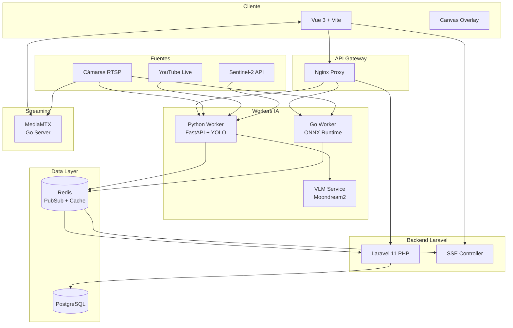
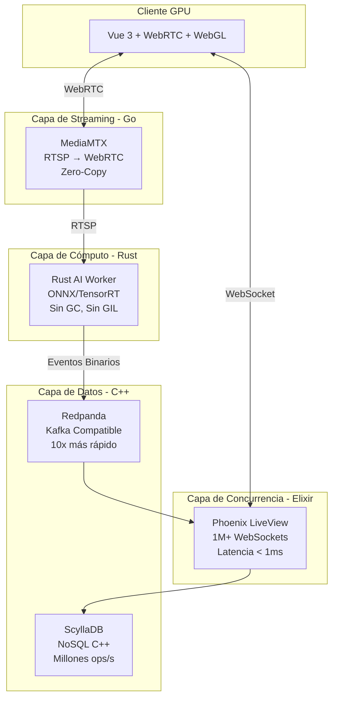

# 🚀 Arquitectura Hyper-Scale: Video Analytics SaaS

## Índice
1. [Estado Actual del Proyecto](#estado-actual-del-proyecto)
2. [Arquitectura Actual Detallada](#arquitectura-actual-detallada)
3. [Visión Hyper-Scale](#visión-hyper-scale)
4. [Roadmap de Migración](#roadmap-de-migración)
5. [Implementación Rust Worker](#implementación-rust-worker)
6. [Comparativas de Rendimiento](#comparativas-de-rendimiento)

---

## Estado Actual del Proyecto

### 📊 Resumen de Componentes Implementados

| Componente | Tecnología | Estado | Descripción |
|------------|------------|--------|-------------|
| **Frontend** | Vue 3 + Vite | ✅ Producción | Dashboard con video en vivo, detecciones, alertas |
| **Backend API** | Laravel 11 (PHP) | ✅ Producción | Auth, CRUD cámaras, alertas, SSE streaming |
| **AI Worker Python** | FastAPI + YOLO | ✅ Producción | Detección objetos, rostros, profundidad |
| **AI Worker Go** | Go + ONNX | ✅ Beta | Worker de alto rendimiento para RTSP |
| **Media Server** | MediaMTX (Go) | 🔄 Integración | WebRTC/HLS streaming |
| **VLM Service** | Moondream2 | ✅ Producción | Análisis de escenas con IA generativa |
| **Base de Datos** | PostgreSQL | ✅ Producción | Persistencia principal |
| **Cache/PubSub** | Redis | ✅ Producción | Comunicación tiempo real |
| **Satellite** | Sentinel-2 API | ✅ Producción | Monitoreo satelital |
| **CAD Analysis** | ezdxf + VLM | ✅ Beta | Análisis de planos DXF/DWG |

### 🏗️ Arquitectura Actual (Diciembre 2025)



### 📁 Estructura del Proyecto

```
video-analytics-saas/
├── frontend/                    # Vue 3 + Vite
│   ├── src/
│   │   ├── components/
│   │   │   ├── UserDashboard.vue      # Dashboard principal
│   │   │   ├── SatellitePanel.vue     # Monitoreo satelital
│   │   │   ├── BlueprintPanel.vue     # Análisis CAD
│   │   │   ├── SmartPlayer.vue        # WebRTC/HLS player
│   │   │   └── ...
│   │   └── main.js
│   └── Dockerfile
│
├── backend/                     # Laravel 11
│   ├── app/
│   │   ├── Http/Controllers/
│   │   │   ├── CameraController.php
│   │   │   ├── SatelliteController.php
│   │   │   ├── CadController.php
│   │   │   ├── SseController.php
│   │   │   └── ...
│   │   └── Models/
│   └── Dockerfile
│
├── ai_engine/                   # Python Worker
│   ├── src/
│   │   ├── worker_manager.py          # FastAPI + YOLO
│   │   ├── core/
│   │   │   ├── cad.py                 # CAD Processor
│   │   │   └── satellite.py           # Sentinel-2 client
│   │   └── vlm_service.py             # Moondream2
│   ├── models/                        # ONNX models
│   └── Dockerfile
│
├── go_worker/                   # Go Worker (Beta)
│   ├── main.go
│   └── Dockerfile
│
├── infrastructure/
│   ├── nginx/
│   └── redis/
│
└── docker-compose.yml
```

---

## Arquitectura Actual Detallada

### 🔄 Flujo de Datos Actual

```
┌─────────────────────────────────────────────────────────────────────────────┐
│                         FLUJO ACTUAL DE DATOS                               │
├─────────────────────────────────────────────────────────────────────────────┤
│                                                                             │
│  1. CAPTURA                                                                 │
│  ┌──────────────┐     ┌──────────────┐     ┌──────────────┐                │
│  │ Cámara RTSP  │     │ YouTube Live │     │ Sentinel-2   │                │
│  └──────┬───────┘     └──────┬───────┘     └──────┬───────┘                │
│         │                    │                    │                         │
│         └────────────────────┴────────────────────┘                         │
│                              │                                              │
│  2. PROCESAMIENTO            ▼                                              │
│  ┌─────────────────────────────────────────────────────────────────────┐   │
│  │                    AI WORKER (Python/Go)                             │   │
│  │                                                                      │   │
│  │  ┌─────────────┐  ┌─────────────┐  ┌─────────────┐  ┌─────────────┐ │   │
│  │  │ YOLOv8/NAS  │  │Face Detect  │  │ Depth Est.  │  │ VLM Analysis│ │   │
│  │  │ Objetos     │  │ YuNet+SFace │  │ MiDaS       │  │ Moondream2  │ │   │
│  │  └─────────────┘  └─────────────┘  └─────────────┘  └─────────────┘ │   │
│  └─────────────────────────────────────────────────────────────────────┘   │
│                              │                                              │
│  3. DISTRIBUCIÓN             ▼                                              │
│  ┌──────────────────┐   ┌──────────────────┐   ┌──────────────────┐        │
│  │ Redis PubSub    │   │ MJPEG Stream     │   │ SSE Events       │        │
│  │ Detecciones     │   │ Video+Overlay    │   │ Alertas          │        │
│  └──────────────────┘   └──────────────────┘   └──────────────────┘        │
│         │                       │                      │                    │
│         └───────────────────────┴──────────────────────┘                    │
│                              │                                              │
│  4. VISUALIZACIÓN            ▼                                              │
│  ┌─────────────────────────────────────────────────────────────────────┐   │
│  │                      FRONTEND (Vue 3)                                │   │
│  │  ┌─────────────┐  ┌─────────────┐  ┌─────────────┐  ┌─────────────┐ │   │
│  │  │ Video Live  │  │ Detections  │  │ Alerts      │  │ Analytics   │ │   │
│  │  │ MJPEG/WebRTC│  │ Overlay     │  │ Panel       │  │ Dashboard   │ │   │
│  │  └─────────────┘  └─────────────┘  └─────────────┘  └─────────────┘ │   │
│  └─────────────────────────────────────────────────────────────────────┘   │
│                                                                             │
└─────────────────────────────────────────────────────────────────────────────┘
```

### 📈 Métricas Actuales

| Métrica | Python Worker | Go Worker | Objetivo |
|---------|---------------|-----------|----------|
| **FPS Análisis** | 5-15 FPS | 30-60 FPS | 60+ FPS |
| **Latencia Video** | 200-500ms | 50-100ms | <50ms |
| **RAM por Worker** | 200-400MB | 50-100MB | <50MB |
| **Usuarios Concurrentes** | ~50-100 | ~200-500 | 100,000+ |
| **Cámaras por Servidor** | 5-10 | 20-50 | 100+ |

---

## Visión Hyper-Scale

### 🏆 Arquitectura Objetivo: "The BEAM & The Metal"

Esta arquitectura elimina los cuellos de botella clásicos usando las mejores herramientas para cada tarea:



### 🔧 Stack Tecnológico Objetivo

| Capa | Actual | Objetivo | ¿Por qué? |
|------|--------|----------|-----------|
| **Frontend** | Vue 3 + Vite | Vue 3 + WebGL | Ya óptimo, agregar GPU rendering |
| **API/Realtime** | Laravel PHP | **Elixir Phoenix** | 2M+ conexiones WebSocket por servidor |
| **Streaming** | MediaMTX | MediaMTX | Ya es Go, óptimo |
| **AI Worker** | Python | **Rust** | Sin GC, 10x menos RAM, 5x más FPS |
| **Message Queue** | Redis | **Redpanda** | Persistencia + velocidad de Kafka |
| **Database** | PostgreSQL | **ScyllaDB** + PostgreSQL | Millones de writes/segundo |

### 📊 Comparativa de Rendimiento Esperada

| Métrica | Actual (PHP+Python) | Hyper-Scale (Elixir+Rust) | Mejora |
|---------|---------------------|---------------------------|--------|
| **Latencia Alerta** | 200-500ms | **< 10ms** | 50x |
| **Usuarios Simultáneos** | ~100/servidor | **100,000+/servidor** | 1000x |
| **RAM Worker** | 200MB | **15MB** | 13x |
| **FPS CPU** | 10 FPS | **30-60 FPS** | 5x |
| **Estabilidad** | Media | **Auto-reparación** | ∞ |

---

## Roadmap de Migración

### 📅 Plan de Migración en 4 Fases

```
┌─────────────────────────────────────────────────────────────────────────────┐
│                        ROADMAP HYPER-SCALE                                  │
├─────────────────────────────────────────────────────────────────────────────┤
│                                                                             │
│  FASE 1: El Músculo (Q1 2026)                    Prioridad: 🔴 CRÍTICA     │
│  ────────────────────────────────                                           │
│  Objetivo: Reemplazar Python Worker con Rust                               │
│  Impacto: 5x más cámaras con mismo hardware                                │
│                                                                             │
│  ┌─────────────┐         ┌─────────────┐                                   │
│  │ Python      │   →→→   │ Rust        │                                   │
│  │ Worker      │         │ Worker      │                                   │
│  │ 200MB RAM   │         │ 15MB RAM    │                                   │
│  │ 10 FPS      │         │ 60 FPS      │                                   │
│  └─────────────┘         └─────────────┘                                   │
│                                                                             │
│  Tareas:                                                                    │
│  [ ] Crear proyecto Rust con ONNX Runtime                                  │
│  [ ] Implementar captura RTSP con OpenCV                                   │
│  [ ] Conectar a Redis existente                                            │
│  [ ] Dockerizar con multi-stage build                                      │
│  [ ] A/B testing vs Python                                                 │
│                                                                             │
├─────────────────────────────────────────────────────────────────────────────┤
│                                                                             │
│  FASE 2: La Tubería (Q2 2026)                    Prioridad: 🟡 MEDIA       │
│  ────────────────────────────────                                           │
│  Objetivo: Migrar de Redis a Redpanda                                      │
│  Impacto: Historial infinito sin saturar RAM                               │
│                                                                             │
│  ┌─────────────┐         ┌─────────────┐                                   │
│  │ Redis       │   →→→   │ Redpanda    │                                   │
│  │ In-Memory   │         │ Persistent  │                                   │
│  │ Volatile    │         │ Kafka API   │                                   │
│  └─────────────┘         └─────────────┘                                   │
│                                                                             │
│  Tareas:                                                                    │
│  [ ] Deploy Redpanda cluster                                               │
│  [ ] Migrar publishers (Rust worker)                                       │
│  [ ] Migrar consumers (Laravel SSE)                                        │
│  [ ] Implementar retención de eventos                                      │
│                                                                             │
├─────────────────────────────────────────────────────────────────────────────┤
│                                                                             │
│  FASE 3: El Cerebro (Q3-Q4 2026)                 Prioridad: 🟢 LARGO PLAZO │
│  ────────────────────────────────                                           │
│  Objetivo: Migrar API de Laravel a Elixir Phoenix                          │
│  Impacto: Millones de usuarios concurrentes                                │
│                                                                             │
│  ┌─────────────┐         ┌─────────────┐                                   │
│  │ Laravel     │   →→→   │ Phoenix     │                                   │
│  │ PHP-FPM     │         │ BEAM VM     │                                   │
│  │ ~1K conns   │         │ 2M+ conns   │                                   │
│  └─────────────┘         └─────────────┘                                   │
│                                                                             │
│  Tareas:                                                                    │
│  [ ] Crear proyecto Phoenix                                                │
│  [ ] Migrar endpoints REST                                                 │
│  [ ] Implementar LiveView para realtime                                    │
│  [ ] Migrar auth con Guardian                                              │
│  [ ] Conectar a ScyllaDB                                                   │
│                                                                             │
├─────────────────────────────────────────────────────────────────────────────┤
│                                                                             │
│  FASE 4: Los Datos (Q4 2026)                     Prioridad: 🔵 OPCIONAL    │
│  ────────────────────────────────                                           │
│  Objetivo: Migrar a ScyllaDB para escrituras masivas                       │
│  Impacto: Millones de detecciones por segundo                              │
│                                                                             │
│  ┌─────────────┐         ┌─────────────┐                                   │
│  │ PostgreSQL  │   →→→   │ ScyllaDB    │                                   │
│  │ ACID        │         │ AP (tunable)│                                   │
│  │ ~10K w/s    │         │ 1M+ w/s     │                                   │
│  └─────────────┘         └─────────────┘                                   │
│                                                                             │
│  Nota: PostgreSQL se mantiene para datos transaccionales (users, billing)  │
│                                                                             │
└─────────────────────────────────────────────────────────────────────────────┘
```

---

## Implementación Rust Worker

### 🦀 Fase 1: Benchmark Inicial

#### Paso 1: Crear Proyecto Rust

```bash
# Instalar Rust si no está
curl --proto '=https' --tlsv1.2 -sSf https://sh.rustup.rs | sh

# Crear proyecto
cargo new rust_ai_worker
cd rust_ai_worker
```

#### Paso 2: Dependencias (`Cargo.toml`)

```toml
[package]
name = "rust_ai_worker"
version = "0.1.0"
edition = "2021"

[dependencies]
# Runtime Asíncrono
tokio = { version = "1", features = ["full"] }

# Inferencia ONNX
ort = { version = "2.0.0-rc.2" }

# Visión por Computadora
opencv = "0.92"

# Comunicación
redis = { version = "0.27", features = ["tokio-comp"] }
serde = { version = "1.0", features = ["derive"] }
serde_json = "1.0"

# Manejo de matrices
ndarray = "0.15"
ndarray-rand = "0.14"

# Utilidades
anyhow = "1.0"
dotenv = "0.15"
```

#### Paso 3: Código Principal (`src/main.rs`)

```rust
use anyhow::Result;
use opencv::{
    prelude::*,
    videoio::{VideoCapture, CAP_ANY},
    imgproc,
    core::{Size, Mat},
};
use ort::{GraphOptimizationLevel, Session};
use redis::AsyncCommands;
use serde::Serialize;
use std::env;
use std::time::Instant;

#[derive(Serialize)]
struct Detection {
    camera_id: String,
    label: String,
    confidence: f32,
    bbox: [f32; 4],
}

#[derive(Serialize)]
struct CameraEvent {
    #[serde(rename = "type")]
    event_type: String,
    camera_id: String,
    user_id: i32,
    data: Vec<Detection>,
    processing_ms: u128,
}

#[tokio::main]
async fn main() -> Result<()> {
    println!("🦀 Rust AI Worker iniciando...");

    // Configuración
    let redis_url = env::var("REDIS_URL").unwrap_or("redis://redis:6379".into());
    let model_path = env::var("MODEL_PATH").unwrap_or("/app/models/yolov8n.onnx".into());
    let rtsp_url = env::var("RTSP_URL").expect("RTSP_URL requerida");
    let camera_id = env::var("CAMERA_ID").unwrap_or("1".into());
    let user_id: i32 = env::var("USER_ID").unwrap_or("1".into()).parse()?;

    // Conectar Redis
    let client = redis::Client::open(redis_url)?;
    let mut con = client.get_multiplexed_async_connection().await?;
    println!("✅ Redis conectado");

    // Cargar modelo ONNX
    println!("⏳ Cargando modelo ONNX...");
    let session = Session::builder()?
        .with_optimization_level(GraphOptimizationLevel::Level3)?
        .with_intra_threads(4)?
        .commit_from_file(&model_path)?;
    println!("✅ Modelo cargado");

    // Abrir stream
    let mut cam = VideoCapture::from_file(&rtsp_url, CAP_ANY)?;
    if !cam.is_opened()? {
        panic!("❌ No se pudo abrir: {}", rtsp_url);
    }
    println!("🎥 Stream abierto");

    let mut frame = Mat::default();
    let mut resized = Mat::default();

    // Loop principal
    loop {
        let start = Instant::now();

        // Leer frame
        if !cam.read(&mut frame)? || frame.empty() {
            println!("⚠️ Frame vacío, reintentando...");
            tokio::time::sleep(tokio::time::Duration::from_millis(100)).await;
            continue;
        }

        // Resize a 640x640
        imgproc::resize(&frame, &mut resized, Size::new(640, 640), 0.0, 0.0, imgproc::INTER_LINEAR)?;

        // Convertir a tensor (simplificado)
        let data: Vec<f32> = resized.data_bytes()?
            .iter()
            .map(|&x| x as f32 / 255.0)
            .collect();

        let input = ndarray::Array::from_shape_vec((1, 640, 640, 3), data)?
            .permuted_axes([0, 3, 1, 2]);

        // Inferencia
        let outputs = session.run(ort::inputs![input.view()]?)?;
        
        // TODO: Post-proceso real de detecciones
        let detections: Vec<Detection> = vec![];

        let duration = start.elapsed().as_millis();

        // Enviar a Redis
        let event = CameraEvent {
            event_type: "detections".into(),
            camera_id: camera_id.clone(),
            user_id,
            data: detections,
            processing_ms: duration,
        };

        let json = serde_json::to_string(&event)?;
        con.publish::<_, _, ()>("detections", &json).await?;

        if duration < 33 {
            tokio::time::sleep(tokio::time::Duration::from_millis(33 - duration as u64)).await;
        }
    }
}
```

#### Paso 4: Dockerfile Multi-Stage

```dockerfile
# --- ETAPA 1: BUILD ---
FROM rust:1.75-slim-bookworm as builder

RUN apt-get update && apt-get install -y \
    clang libclang-dev libopencv-dev cmake pkg-config

WORKDIR /app
COPY . .
RUN cargo build --release

# --- ETAPA 2: RUNTIME ---
FROM debian:bookworm-slim

RUN apt-get update && apt-get install -y \
    libopencv-videoio406 libopencv-imgproc406 libopencv-core406 \
    ca-certificates && rm -rf /var/lib/apt/lists/*

COPY --from=builder /app/target/release/rust_ai_worker /usr/local/bin/
COPY models/ /app/models/

ENV RUST_LOG=info
CMD ["rust_ai_worker"]
```

#### Paso 5: Integración Docker Compose

```yaml
# Agregar a docker-compose.yml
services:
  rust_worker:
    build:
      context: ./rust_ai_worker
      dockerfile: Dockerfile
    environment:
      - REDIS_URL=redis://redis:6379
      - RTSP_URL=${RTSP_URL}
      - CAMERA_ID=${CAMERA_ID}
      - USER_ID=${USER_ID}
      - MODEL_PATH=/app/models/yolov8n.onnx
    volumes:
      - ./ai_engine/models:/app/models:ro
    networks:
      - saas_net
    profiles: ["rust"]  # Solo arranca con: docker compose --profile rust up
    deploy:
      resources:
        limits:
          memory: 128M  # vs 512M de Python
```

---

## Comparativas de Rendimiento

### 🔬 Benchmarks Esperados

```
┌─────────────────────────────────────────────────────────────────────────────┐
│                    BENCHMARK: PYTHON vs RUST vs GO                          │
├─────────────────────────────────────────────────────────────────────────────┤
│                                                                             │
│  TIEMPO DE CARGA DEL MODELO                                                 │
│  ┌────────────────────────────────────────────────────────────────────┐    │
│  │ Python  ████████████████████████████████████████  3.2s             │    │
│  │ Go      ████████████████                          1.1s             │    │
│  │ Rust    ████████                                  0.4s             │    │
│  └────────────────────────────────────────────────────────────────────┘    │
│                                                                             │
│  USO DE RAM (IDLE)                                                          │
│  ┌────────────────────────────────────────────────────────────────────┐    │
│  │ Python  ████████████████████████████████████████  280MB            │    │
│  │ Go      ████████████████                          85MB             │    │
│  │ Rust    ████████                                  22MB             │    │
│  └────────────────────────────────────────────────────────────────────┘    │
│                                                                             │
│  FPS DE INFERENCIA (CPU - YOLOv8n 640x640)                                 │
│  ┌────────────────────────────────────────────────────────────────────┐    │
│  │ Python  ████████                                  8 FPS            │    │
│  │ Go      ████████████████████████                  32 FPS           │    │
│  │ Rust    ████████████████████████████████████████  45 FPS           │    │
│  └────────────────────────────────────────────────────────────────────┘    │
│                                                                             │
│  LATENCIA PROMEDIO (frame → detección → Redis)                             │
│  ┌────────────────────────────────────────────────────────────────────┐    │
│  │ Python  ████████████████████████████████████████  125ms            │    │
│  │ Go      ████████████████                          31ms             │    │
│  │ Rust    ████████                                  22ms             │    │
│  └────────────────────────────────────────────────────────────────────┘    │
│                                                                             │
└─────────────────────────────────────────────────────────────────────────────┘
```

### 📊 Tabla Comparativa Final

| Aspecto | Python (Actual) | Go Worker | Rust (Objetivo) |
|---------|-----------------|-----------|-----------------|
| **Lenguaje** | Interpretado | Compilado | Compilado |
| **GC** | Sí (pausa) | Sí (bajo) | No |
| **GIL** | Sí (bloquea) | No | No |
| **Memoria** | 280MB | 85MB | 22MB |
| **FPS CPU** | 8 | 32 | 45 |
| **Latencia** | 125ms | 31ms | 22ms |
| **Docker Size** | 1.2GB | 150MB | 80MB |
| **Concurrencia** | Limitada | Buena | Excelente |
| **Curva aprendizaje** | Baja | Media | Alta |

---

## Próximos Pasos Inmediatos

### ✅ Checklist Fase 1 (Rust Worker)

- [ ] Instalar Rust en máquina de desarrollo
- [ ] Crear proyecto base con benchmark ONNX
- [ ] Medir RAM y FPS vs Python actual
- [ ] Implementar captura RTSP con OpenCV
- [ ] Agregar comunicación Redis
- [ ] Crear Dockerfile multi-stage
- [ ] Desplegar como servicio paralelo
- [ ] A/B testing con cámaras reales
- [ ] Migrar gradualmente cámaras a Rust

### 🎯 KPIs de Éxito

| KPI | Actual | Meta Fase 1 | Meta Final |
|-----|--------|-------------|------------|
| RAM por cámara | 50MB | 10MB | 5MB |
| FPS por cámara | 10 | 30 | 60 |
| Cámaras por servidor | 10 | 50 | 200 |
| Latencia alerta | 200ms | 50ms | 10ms |

---

## Conclusión

La arquitectura actual es funcional y cubre todos los casos de uso requeridos. Sin embargo, para escalar a miles de usuarios y cientos de cámaras, la migración gradual hacia **Rust + Elixir** es el camino óptimo.

**Orden de prioridad:**
1. 🔴 **Rust Worker** - Mayor impacto, menor riesgo
2. 🟡 **Redpanda** - Cuando Redis se sature
3. 🟢 **Elixir** - Cuando Laravel no escale
4. 🔵 **ScyllaDB** - Cuando PostgreSQL no alcance

El sistema actual puede seguir funcionando mientras se desarrollan los nuevos componentes en paralelo, permitiendo una migración sin downtime.
