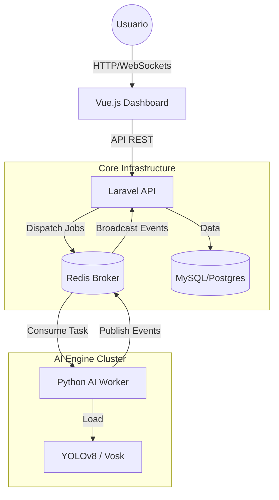

# 📹 Video Analytics SaaS Platform

Plataforma de análisis de video en tiempo real basada en microservicios. Utiliza Inteligencia Artificial (YOLO + Vosk) para detección de objetos, análisis de tráfico, seguridad y comprensión semántica de audio.

Orquestado con **Laravel**, visualizado con **Vue.js**, procesado por **Python Workers** y comunicado vía **Redis**.

-----

## 🏗️ Arquitectura del Sistema

El sistema sigue una arquitectura orientada a eventos desacoplada:



### Servicios Principales

  * **API (`/backend`):** Laravel 10. Gestiona cámaras, usuarios, autenticación y orquesta el inicio/fin de streams.
  * **Frontend (`/frontend`):** Vue 3 + Vite. Panel de control reactivo.
  * **AI Worker (`/ai_engine`):** Python 3.11. Worker escalable que consume tareas de Redis, procesa video (OpenCV/YOLO) y audio (Vosk), y emite alertas.
  * **Broker:** Redis. Maneja las colas de trabajo y los eventos en tiempo real (Pub/Sub).

-----

## 🌿 Git Flow & Entornos

Utilizamos una estrategia de ramas estricta para garantizar la estabilidad en producción.

| Rama Git | Entorno | Configuración Docker | Propósito |
| :--- | :--- | :--- | :--- |
| `development` | **Local / Staging** | `docker-compose.yml` + `docker-compose.dev.yml` | Desarrollo activo, pruebas, hot-reloading. |
| `main` | **Producción** | `docker-compose.yml` (Base) | Versión estable, optimizada, sin herramientas de dev. |

-----

## 🚀 Guía de Desarrollo Local

Para trabajar en tu máquina con **Hot Reloading** (ver cambios al instante) y herramientas de ML.

### 1\. Requisitos

  * Docker & Docker Compose
  * Git

### 2\. Configuración Inicial

Asegúrate de tener el archivo `docker-compose.dev.yml` (no incluido en el repo por defecto, créalo si no existe para habilitar volúmenes espejo):

```bash
# Levantar el entorno de desarrollo (fusiona config base + dev)
docker-compose -f docker-compose.yml -f docker-compose.dev.yml up -d
```

### 3\. Accesos Locales

  * **Frontend:** [http://localhost:5173](https://www.google.com/search?q=http://localhost:5173)
  * **API Backend:** [http://localhost:8000](https://www.google.com/search?q=http://localhost:8000)
  * **Label Studio (Etiquetado):** [http://localhost:8080](https://www.google.com/search?q=http://localhost:8080) (Si está activado en dev)

### 4\. Reentrenamiento (Active Learning Loop)

En entorno local, los workers guardan imágenes con baja confianza en `./ai_engine/data_to_review`.

1.  Abre Label Studio en el puerto 8080.
2.  Importa las imágenes y corrige las detecciones.
3.  Exporta el dataset y reentrena YOLO.
4.  Reemplaza el modelo en `/ai_engine/models/yolov8n.pt`.

-----

## 🚢 Despliegue con Dockploy

Dockploy se encarga de construir las imágenes de producción. No es necesario subir el archivo `.dev.yml`.

### A. Entorno Staging (Pruebas)

  * **Conectar Repo:** `https://github.com/TU_USUARIO/video-analytics-saas.git`
  * **Branch:** Seleccionar `development`.
  * **Variables de Entorno:** Configurar DB y Redis (ver abajo).
  * **Funcionamiento:** Desplegará la última versión de desarrollo pero construyendo las imágenes finales (simulación real).

### B. Entorno Producción (Live)

  * **Conectar Repo:** Mismo repositorio.
  * **Branch:** Seleccionar `main`.
  * **Estrategia:** Solo hacer Merge a `main` cuando Staging esté verificado.

### Variables de Entorno Requeridas (Dockploy)

Añadir estas variables en la configuración del servicio en Dockploy:

```ini
# Base de Datos
DB_HOST=db
DB_DATABASE=saas_video
DB_USERNAME=root
DB_PASSWORD=secret_secure_password
MYSQL_ROOT_PASSWORD=secret_secure_password

# Redis
REDIS_HOST=redis
REDIS_PORT=6379

# Laravel
APP_ENV=production
APP_KEY=base64:TU_CLAVE_GENERADA_AQUI
APP_DEBUG=false
APP_URL=https://tu-dominio.com
```

-----

## 📂 Estructura del Proyecto

```text
video-analytics-saas/
├── docker-compose.yml       # Configuración BASE (Producción)
├── docker-compose.dev.yml   # Configuración DEV (Local override)
├── backend/                 # Código Laravel (API)
│   ├── app/Jobs/            # Jobs que envían tareas a Python
│   └── Dockerfile           # PHP 8.2 FPM
├── frontend/                # Código Vue.js
│   └── Dockerfile           # Node Alpine
├── ai_engine/               # Código Python
│   ├── src/worker_manager.py # Entrypoint (Escucha Redis)
│   ├── models/              # Archivos .pt (YOLO) y modelos Vosk
│   └── Dockerfile           # Python 3.11 Slim + OpenCV
└── infrastructure/          # Configs de Nginx/Redis
```

## 🛠️ Comandos Útiles

```bash
# Entrar a la terminal de Laravel
docker-compose exec api bash

# Instalar dependencias PHP (si se agregan nuevas)
docker-compose run --rm api composer install

# Ver logs del Worker de IA
docker-compose logs -f ai_worker

# Limpiar todo (Reset de fábrica)
docker-compose down -v --remove-orphans
```


## 🛠️ El Flujo de Trabajo (Workflow)
Así es como trabajarás día a día:

A. En tu Computadora (Local Development)
Estás en la rama development. Para trabajar, necesitas fusionar el archivo base con el de desarrollo. No uses docker-compose up a secas. Usa este comando:

Bash+

# Levanta usando ambos archivos
docker-compose -f docker-compose.yml -f docker-compose.dev.yml up
Tip: Crea un alias en tu terminal o un archivo Makefile para no escribir eso siempre. Por ejemplo, make dev.

B. En Dockploy (Entorno de Staging / Pruebas)
Aquí quieres ver cómo se comporta la rama development en un servidor real.

En Dockploy, crea un Nuevo Proyecto (ej: video-saas-staging).

Conéctalo a tu repo GitHub.

Branch: Selecciona development.

Despliega.

¿Qué pasa aquí? Como Dockploy ejecuta docker-compose up estándar, ignorará el archivo docker-compose.dev.yml.

Resultado: Se desplegará la versión de desarrollo, pero usando contenedores construidos (build) igual que en producción. ¡Perfecto para probar antes de pasar a Main!

C. En Dockploy (Entorno de Producción)
En Dockploy, tienes tu proyecto principal (video-saas-prod).

Branch: Selecciona main.

Despliega.

Cómo gestionar las ramas en Git
Aquí tienes los comandos para organizar tu repo ahora mismo:

Bash

# 1. Crear y cambiar a la rama de desarrollo
git checkout -b development

# 2. Agregar tu archivo de configuración dev (si quieres compartirlo con el equipo)
git add docker-compose.dev.yml
git commit -m "chore: add development environment config"
git push -u origin development

# --- TRABAJAS, EDITAS CÓDIGO ---

# 3. Subir cambios a desarrollo
git add .
git commit -m "feat: improve yolo detection"
git push origin development 
# (Aquí Dockploy 'Staging' se actualiza si tienes auto-deploy)

# --- TODO ESTÁ LISTO PARA PRODUCCIÓN ---

# 4. Mezclar desarrollo en main
git checkout main
git merge development
git push origin main
# (Aquí Dockploy 'Producción' se actualiza)
Resumen Visual
Tu PC: Corre development + docker-compose.dev.yml.

Dockploy (Staging): Corre development (solo docker-compose.yml).

Dockploy (Prod): Corre main (solo docker-compose.yml).


## ¿Cómo acceder?
En lugar de escribir localhost en el navegador de tu computadora, debes escribir la IP Privada (LAN) o Pública del servidor.

Averigua la IP del servidor: Ejecuta en la terminal del servidor:

Bash

hostname -I
# Te devolverá algo como: 192.168.1.50  o  10.0.0.5
Usa esa IP en tu navegador:

Frontend: http://192.168.1.50:5173

Backend API: http://192.168.1.50:8000

Label Studio: http://192.168.1.50:8080

2. ¿Por qué te funcionará? (La configuración clave)
Para que esto sea posible, tuvimos que asegurarnos de dos cosas en los pasos anteriores (que ya incluí en tus archivos, pero es bueno que sepas por qué):

Frontend (Vite): Por defecto, Vite solo escucha en local. Para que te deje entrar por IP, el comando debe tener la bandera --host.

Tu configuración: command: npm run dev -- --host ✅ (Correcto)

Backend (Laravel): Por defecto, artisan serve solo escucha en local. Necesita --host=0.0.0.0.

Tu configuración: command: php artisan serve --host=0.0.0.0 ... ✅ (Correcto)


## Correr comando dentro de contenedor Docker
docker exec -it code-api-1 php artisan optimize:clear

## Correr tests dentro de contenedor Docker
docker exec -it code-api-1 php artisan test

## URL's Permitidas CORS
dev.pellit.com.ar 
api-dev.pellit.com.ar 
video-dev.pellit.com.ar 
cv.pellit.com.ar 
api-cv.pellit.com.ar 
video.pellit.com.ar;