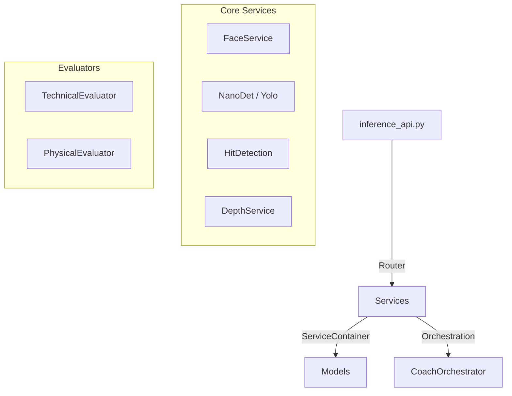

# Documentación Técnica: ai_engine (Inference API)

## 1. Visión General
El módulo `ai_engine` es el núcleo de inferencia de IA diseñado específicamente para ejecutarse en hardware **NVIDIA Jetson Nano**. Expone una API REST (FastAPI) que permite realizar tareas de visión por computadora como detección de objetos, reconocimiento facial, estimación de profundidad y análisis de acciones deportivas. Está optimizado para utilizar aceleración por hardware (CUDA/TensorRT).

## 2. Infraestructura y Despliegue

### 2.1 Orquestación (Docker Compose)
El servicio se define en `docker-compose.jetson.yml`.
*   **Nombre del servicio:** `inference_api` (container: `jetson_inference`).
*   **Base Image:** `dustynv/jetson-inference:r32.7.1` (JetPack 4.6.1).
*   **Puerto:** Expone el puerto `5050`.
*   **Volúmenes Críticos:**
    *   `./ai_engine/onnx:/app/ai_engine/models`: Mapea los modelos ONNX/TensorRT locales al contenedor.
    *   `/home/pta/pta-app/media`: Montaje NFS/Local para acceso a archivos de video grandes.
    *   `jetson_tensorrt_cache`: Persistencia para la compilación de motores TensorRT.
*   **Hardware:** Requiere acceso al runtime de NVIDIA (`runtime: nvidia` implícito o `nvidia-docker`).

### 2.2 Entorno de Ejecución (Dockerfile)
Definido en `ai_engine/Dockerfile.jetson`. El entorno es complejo debido a las limitaciones de la Jetson Nano:
*   **Sistema Base:** Ubuntu 18.04 (L4T).
*   **Python:** Compilación manual de **Python 3.11.9** (el sistema base trae Python 3.6, obsoleto).
*   **OpenCV:** Compilación manual de **OpenCV 4.10.0 con soporte CUDA y GStreamer**.
*   **Librerías Clave:** `jetson-inference` (recompilado para Py3.11), `numpy`, `uvicorn`, `fastapi`.

## 3. Arquitectura del Software

El código fuente reside en `ai_engine/src`. Sigue una arquitectura modular centrada en servicios.

### 3.1 Componentes Principales
*   **`inference_api.py`**: Punto de entrada (`app`). Inicializa FastAPI y carga los modelos en memoria al inicio (`@app.on_event("startup")`).
*   **`orchestrator.py`**:
    *   `ServiceContainer`: Singleton que mantiene las instancias de los modelos cargados (para no recargarlos por petición).
    *   `CoachOrchestrator`: Coordina múltiples evaluadores según el "modo" (ej. `soccer`, `fitness`) para análisis deportivos complejos.
*   **Servicios (`src/services/`)**:
    *   `face_service.py`: Detección y reconocimiento facial.
    *   `hit_detection_service_optimized.py`: Detección de golpes (tenis/pádel) usando pose y detección de objetos.
    *   `superres_service.py`: Mejora de calidad de imagen.
    *   `video_io.py`: Utilidades para manejo seguro de subida y lectura de videos.

## 4. Modelos de IA Utilizados

Los modelos se cargan desde `/app/ai_engine/models` (mapeado desde el host).

| Tarea | Modelo Principal | Fallback / Notas |
| :--- | :--- | :--- |
| **Detección Objetos** | **NanoDet-Plus** (416x416) | Optimizado para bajo consumo en Nano. |
| **Detección Rostros** | `face_detection_yunet_2023mar.onnx` | Modelo ligero de OpenCV Zoo. |
| **Reconocimiento Facial** | `face_recognition_sface_2021dec.onnx` | Generación de embeddings. |
| **Profundidad** | MiDaS v2.1 Small | Estimación monocular de profundidad. |
| **Super Resolución** | ESPCN / FSRCNN | Escalado de imágenes x4. |
| **Pose / Acción** | ActionNet / PoseNet | Integrados vía `jetson-inference` o YOLOv8 (onnx). |

## 5. API Reference (Clave)

La API acepta tanto imágenes en Base64 como archivos de video (`multipart/form-data`).

### Endpoints de Detección
*   `POST /detect/nanodet`: Detección rápida en imagen única (Base64).
    *   *Input:* `{"image_base64": "data:image...", "confidence": 0.5}`
    *   *Output:* JSON con bounding boxes y etiquetas.
*   `POST /detect/nanodet/video`: Procesa un archivo de video subido.
    *   *Params:* `frame_stride` (procesar cada N frames), `max_frames`.
    *   *Output:* JSON con lista de detecciones frame a frame.

### Endpoints Faciales
*   `POST /face/consistency-video`: Analiza un video completo para verificar si aparece consistentemente la misma persona (seguridad/identidad). Muestrea frames distribuidos en el tiempo.

### Endpoints Deportivos
*   `POST /detect/hit/video`: Analiza secuencias de golpeo usando lógica combinada de detección de pelota y pose del jugador.

### Endpoints de Utilidad
*   `POST /superres/apply`: Aplica super-resolución a una imagen.
*   `GET /health`: Estado del servicio.

## 6. Flujo de Desarrollo Sugerido

1.  **Agregar un modelo**: Simplemente poner el `.onnx` en `./ai_engine/onnx` en el host. El Docker lo verá automáticamente en `/app/ai_engine/models`.
2.  **Modificar lógica**: Editar archivos en `./ai_engine/src`. El volumen montado permite hot-reload si se usa `uvicorn --reload` (aunque el compose actual usa workers fijos).
3.  **Logs**: Revisar `logs/nfs_analyzer.log` dentro del contenedor o vía `docker logs jetson_inference` para ver el rendimiento de inferencia y tiempos de carga.
